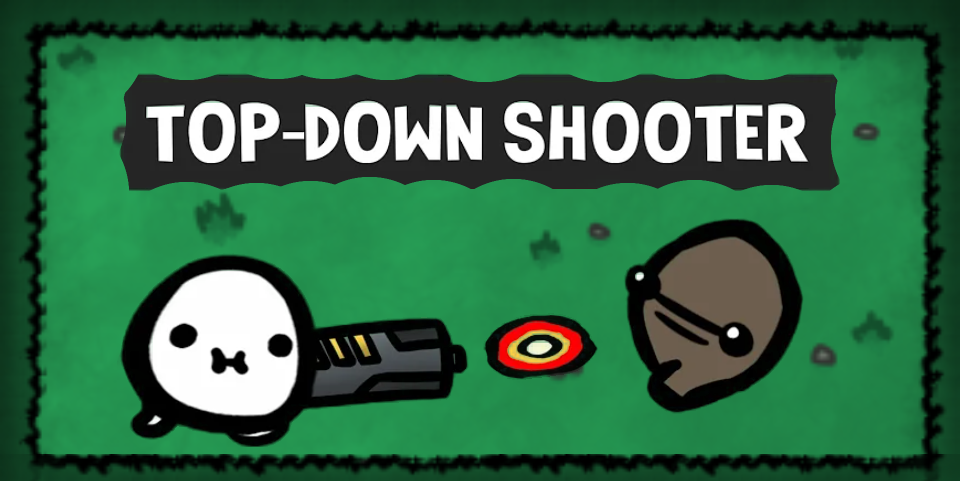
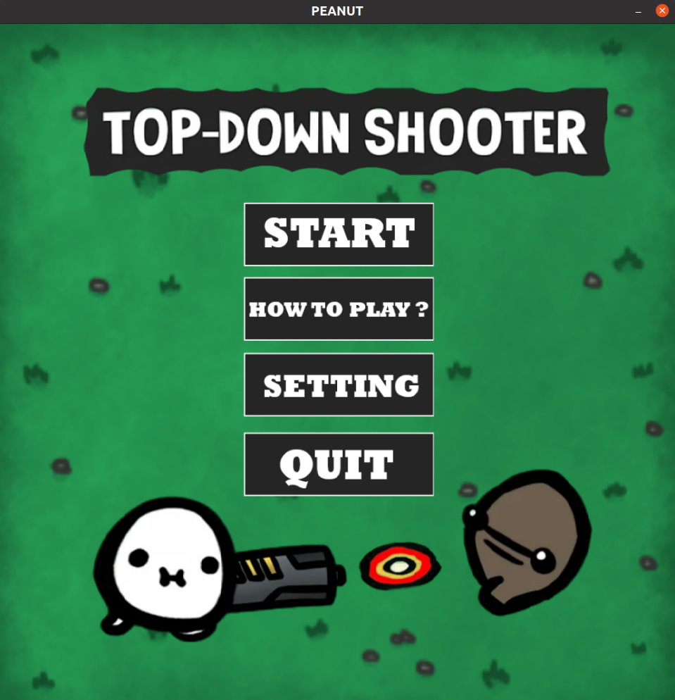
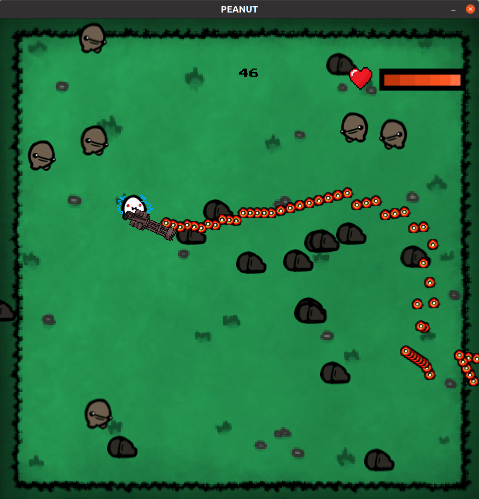

# Top-Down Shooter 
> This is a game project for __INT2215__ made using C++ and [SDL2](https://www.libsdl.org/)

## About the game
 - This is a simple game in which player control a character with W,A,S,D key, the character has his gun point to the mouse pointer , he will shot when player click the mouse. Hitting the mistery box for a chance to get a machine gun, which will fire continuously when the player holds down the mouse button , it will clear enemies really fast
- Don't let the enemies come near character because if they touch the character , they will blow and the character will lose health, losing too much health leads to death and *GAME OVER*
- Try to get as many scores as possible , you gain one score when one enemy dies
- **NOTICE** : Play this game will damage your mouse a lots =))

## Setup guide
- Install Codeblocks , Visual Studio 2019 , Visual Studio Code , XCode ... (I used Visual Studio 2019 to made this game but i still can build & run it with VS Code so use whatever IDE you want, but setup it correctly)
- Install [SDL2](https://www.libsdl.org/) library : Follow tutorials on https://lazyfoo.net/tutorials/ 
## Screenshots

## Video
**A short gameplay video**

## Credit 
- The game assets is from [here](https://itch.io)
- Many sounds from the internet , but i can't remember where i downloaded them
- Free font from [Google Fonts](https://fonts.google.com/)

